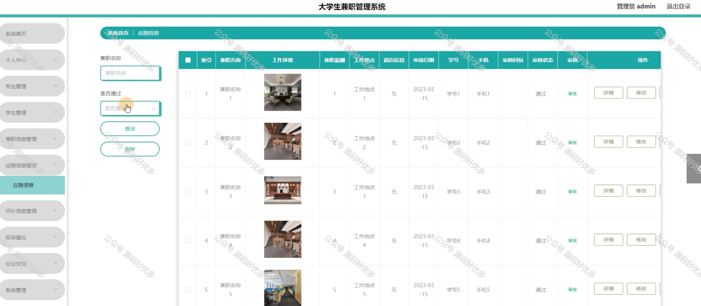

 
## 查看主页获取源码

> **作者介绍**： **✌**全网粉丝10W+本平台特邀作者、博客专家、CSDN新星计划导师、java领域优质创作者,博客之星、掘金/华为云/阿里云/InfoQ等平台优质作者、专注于项目实战 **✌**

  

### 一、作品包含

源码+数据库+设计文档万字+PPT+全套环境和工具资源+部署教程

### 二、项目技术

前端技术：Html、Css、Js、Vue、Element-ui

数据库：MySQL

后端技术：Java、Spring Boot、MyBatis

  

### 三、运行环境

开发工具：IDEA/eclipse

数据库：MySQL5.7

数据库管理工具：Navicat10以上版本

环境配置软件： JDK1.8+Maven3.6.3

前端Nodejs：14

### 四、项目介绍
项目编号：springbootA139

在当前就业形势严峻和大学生就业意识提前的背景下，大学生兼职管理系统应运而生，该系统旨在为大学生提供一个安全、可靠的兼职信息发布与求职平台，通过整合校园内外兼职资源，帮助大学生寻找合适的兼职工作，提高实践能力，同时为用人单位提供便捷的招聘渠道，实现双方需求的有效对接。

前台学生功能：浏览首页、兼职信息、论坛交流、公告信息、投诉建议、后台管理、在线沟通和个人中心。

后台分为管理员和学生
管理员的功能：系统首页、个人中心、专业管理、学生管理、兼职信息管理、应聘信息管理、评价信息管理、投诉建议、投诉交流、论坛交流、系统管理
学生的功能：系统首页、个人中心、应聘信息管理、评价信息管理。
### 五、运行截图

  
